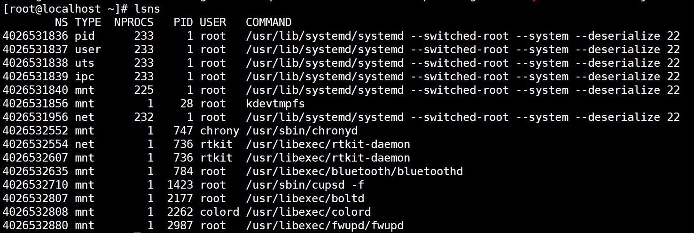

在实现代码的过程中，我们是在解决一个个的问题。

将镜像中的分层内容解析到一个文件夹下。

docker镜像的基础知识

manifest： 基本上对应了一个镜像，里面包含了一个镜像的所有layers digest，客户端拉取镜像的时候一般都是先获取manifest 文件，在根据 manifest 文件里面的内容拉取镜像各个层(tar+gzip)


layer：镜像层，镜像层不包含任何的运行时信息，只包含文件系统的信息。镜像是通过最底层的rootfs加上各层的changeset(对上一层的add、update、delete操作)组合而成的。


计算机领域中最牛逼的是

实现docker，我们要分几步走，将问题划分为子问题。


# 一、管理镜像Image

## 3、1 下载镜像

下载镜像是分为以下5个步骤的：


### 1、下载镜像并存盘至目录

镜像名称的命名：

alpine:latest，通过解析字符串可以获得镜像名称和镜像标签tag。


下载的镜像存储到临时目录/var/lib/gocker/tmp/

举例说明：

image 镜像临时存储路径:/var/lib/gocker/tmp/c059bfaa849c/package.tar


c059bfaa849c是标识镜像唯一性的hash值，是如何计算出来的呢？

image的manifest的哈希值，取前12位。


images.json文件是我们自己维护？还是docker的镜像中本来就有这部分的信息。

所有images镜像的信息，存储在images.json文件中

/var/lib/gocker/images/images.json

```json
{
	"ubuntu" : {
					"18.04": "[image-hash]",
					"18.10": "[image-hash]",
					"19.04": "[image-hash]",
					"19.10": "[image-hash]"
				},
	"centos" : {
					"6.0": "[image-hash]",
					"6.1": "[image-hash]",
					"6.2": "[image-hash]",
					"7.0": "[image-hash]"
				}
}
```

存储当前系统上的镜像信息的文件格式如上所示。

image-hash是镜像的哈希值。


采用什么数据结构来存储不同镜像的不同标签tag版本呢？

map[string] map[string] string

确定采用双层map的方式来存储镜像的信息，然后将数据json序列化后，写入images.json文件中。


TODO:编写demo验证功能（已完成）

crane.Pull和crane.SaveLegacy函数


### 2、解压tar格式镜像

解压tar压缩包到指定目录下

image 镜像存储路径

/var/lib/gocker/tmp/c059bfaa849c/package.tar

将其在当前路径进行解压

即解压package.tar文件中的文件和文件夹到当前目录


解压tar格式的镜像

TODO:编写demo验证功能（提供tar格式镜像前提下，解压）


采用的第三方tar解压缩包如下：

https://github.com/mholt/archiver


### 3、处理镜像的layer分层

- 从指定镜像的manifest.json中解析出镜像的layer分层，/var/lib/gocker/tmp/c059bfaa849c/manifest.json
- 解压layer层文件，这是容器的rootfs基础，解压目录为/var/lib/gocker/images/{image-hash}/
- 由于一个镜像会有多个layer层文件，所以存储目录路径不仅要有镜像的hash值，也要有layer的hash值，/var/lib/gocker/images/{image-hash}/{layer-hash}/fs，{layer-hash}取其layer哈希值的前12位
- 将manifest.json和fullImageHex.json都拷贝到/var/lib/gocker/images/{image-hash}/下面，供以后使用


### 4、解析manifest信息，计算出哈希值

从image镜像中解析出manifest信息。

这个好弄。


5、更新images信息

将新下载成功的image添加到/var/lib/gocker/images/images.json


### 5、删除临时存储目录

使用os.RemoveAll函数


## 3、2 枚举镜像信息

读取/var/lib/gocker/images/images.json文件，从中获取所有镜像的信息。


## 3、3 删除本地镜像


镜像的操作库采用go-containerregistry，是google开源的一个项目，我们这里只用到crane相关的api接口即可。


/var/lib/gocker/images/c059bfaa849c/47d7af55c64c/fs

其中c059bfaa849c和47d7af55c64c这两个值分别代表什么？


layer.tar文件是个简单的文件系统的集合，我们需要把解压后的文件夹放到什么地方呢？


这几个目录都是干什么的，今天必须搞情况，现在也搞的差不多了。

image hash value is manifest [:12] bits
imageShaHex = manifest.Config.Digest.Hex[:12]

different layers file dst path
/var/lib/gocker/images/c059bfaa849c/47d7af55c64c/fs 

/var/lib/gocker/images/images.json

create gocker container path
/var/run/gocker/containers/e910dffe0e1a


如何从指定的文件系统rootfs来启动程序，是个需要好好思考的问题。

# 二、容器隔离 Namespace

容器的存储路径为/var/run/gocker/containers/{containerID}

分别创建以下目录：

/var/run/gocker/containers/{containerID}/fs

/var/run/gocker/containers/{containerID}/fs/mnt

/var/run/gocker/containers/{containerID}/fs/upperdir

/var/run/gocker/containers/{containerID}/fs/workdir


- File system (via `chroot`)
- PID
- IPC
- UTS (hostname)
- Mount
- Network


三、挂载overlay文件系统

```
unix.Mount
```


四、执行容器container

os.Cmd执行命令


# 三、Cgroup使用

Cgroup限制cpu，内存，pids（带领大家实验下）


命名空间的使用

lsns命令的输出结果




资料收集

# Building container images in Go

https://ahmet.im/blog/building-container-images-in-go/


使用到的开源库

https://github.com/google/go-containerregistry


https://www.51cto.com/article/697935.html


这块是我们

# 详解 OCI 容器镜像的层

