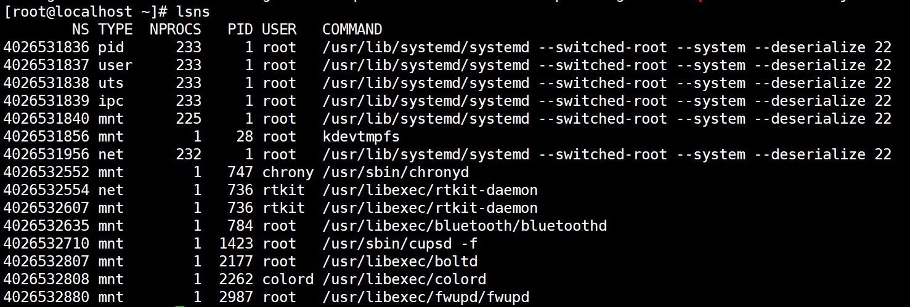

 将镜像中的分层内容解析到一个文件夹下。

进一步来熟悉OCI镜像格式，是一件很重要的事情。clair中是如何来做的呢？分析出镜像中的成分。


docker镜像的基础知识

manifest： 基本上对应了一个镜像，里面包含了一个镜像的所有layers digest值，客户端拉取镜像的时候一般都是先获取manifest 文件，再根据 manifest 文件里面的内容拉取镜像各个层(tar+gzip)


layer：镜像层，镜像层不包含任何的运行时信息，只包含文件系统的信息。镜像是通过最底层的rootfs加上各层的changeset(对上一层的add、update、delete操作)组合而成的。


overlayfs文件系统挂载使用

unix.Mount() 函数提供了挂载的能力

https://pkg.go.dev/golang.org/x/sys/unix#section-readme

在技术分享时，提供个example例子来讲解下unix.Mount以及unix.UnMount两个函数的简单实用。


## 3、2 枚举镜像信息

读取/var/lib/gocker/images/images.json文件，从中获取所有镜像的信息。


## 3、3 删除本地镜像


镜像的操作库采用go-containerregistry，是google开源的一个项目，我们这里只用到crane相关的api接口即可。


/var/lib/gocker/images/c059bfaa849c/47d7af55c64c/fs

其中c059bfaa849c和47d7af55c64c这两个值分别代表什么？


layer.tar文件是个简单的文件系统的集合，我们需要把解压后的文件夹放到什么地方呢？


这几个目录都是干什么的，今天必须搞情况，现在也搞的差不多了。

image hash value is manifest [:12] bits
imageShaHex = manifest.Config.Digest.Hex[:12]

different layers file dst path
/var/lib/gocker/images/c059bfaa849c/47d7af55c64c/fs 

/var/lib/gocker/images/images.json

create gocker container path
/var/run/gocker/containers/e910dffe0e1a


如何从指定的文件系统rootfs来启动程序，是个需要好好思考的问题。

# 二、容器隔离 Namespace

容器的存储路径为/var/run/gocker/containers/{containerID}

分别创建以下目录：

/var/run/gocker/containers/{containerID}/fs

/var/run/gocker/containers/{containerID}/fs/mnt

/var/run/gocker/containers/{containerID}/fs/upperdir

/var/run/gocker/containers/{containerID}/fs/workdir


- File system (via `chroot`)
- PID
- IPC
- UTS (hostname)
- Mount
- Network


三、挂载overlay文件系统

```
unix.Mount
```


四、执行容器container

os.Cmd执行命令


# 三、Cgroup使用

Cgroup限制cpu，内存，pids（带领大家实验下）


命名空间的使用

lsns命令的输出结果




资料收集

# Building container images in Go

https://ahmet.im/blog/building-container-images-in-go/


使用到的开源库

https://github.com/google/go-containerregistry


https://www.51cto.com/article/697935.html


# 详解 OCI 容器镜像的层

