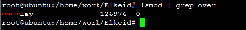
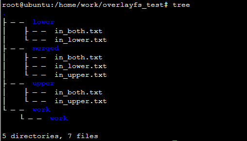
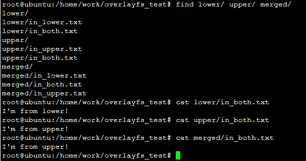

# 一、Overlayfs介绍

联合文件系统，可让你使用2个目录挂载文件系统：

“下层”目录和“上层”目录

基本上：

◈ 文件系统的**下层**目录是只读的

◈ 文件系统的**上层**目录可以读写


进程读写overlayfs文件规则：

1、**当进程“读取”文件时**，overlayfs文件系统驱动将优先在上层目录upperdir中查找并从该目录中读取文件，找不到则在下层目录lowerdir中查找。

2、**当进程"写入"文件时**，overlayfs会将其写入上层目录upperdir。


# 二、Overlayfs简单实战

## 2、1 加载overlayfs模块

查看内核是否加载了overlay

```shell
lsmod | grep overlay
```


如果没加载，则采用如下命令加载：

```shell
modprobe overlay
```

已加载的过overlay模块的如下图所示：




## 2、2 挂载overlayfs文件系统

找一个你喜欢的目录，哈哈，执行如下命令来创建目录和文件

```shell
mkdir upper lower merged work
echo "I'm from lower!" > lower/in_lower.txt
echo "I'm from upper!" > upper/in_upper.txt
# `in_both` is in both directories
echo "I'm from lower!" > lower/in_both.txt
echo "I'm from upper!" > upper/in_both.txt
```

创建文件和目录如下




合并上层目录和下层目录非常容易：我们可以通过 `mount` 来完成！

```
mount -t overlay overlay -o lowerdir=./lower/,upperdir=./upper/,workdir=./work/ ./merged/
```

**lowerdir参数**：下层目录

可以挂载多个下层目录，多个目录之间采用分号分隔。

```
mount -t overlay overlay -o lowerdir:/dir1:/dir2:/dir3:...:/dir25,upperdir=...
```


**upperdir参数**：上层目录


## 2、3 合并后的目录结构



上图可以看到merged文件夹中展示的文件是low和upper里面的文件集合，并且合并后merged/in_both.txt文件时upper/in_both.txt文件，这也符合上面的原则。


参考链接：

公众号《Linux内核那些事》 容器三把斧之 | OverlayFS原理与实现

公众号《Linux内核那些事》Docker原理之 - OverlayFS设计与实现

容器如何工作:OverlayFS | Linux 中国