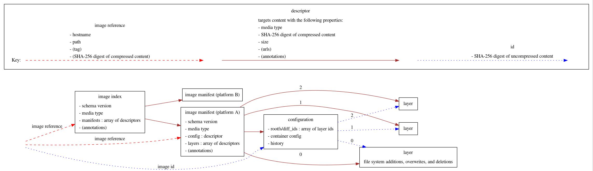

# 访问容器镜像仓库的go客户端之go-containerregistry

# 一、介绍

这是一个用于处理容器仓库的golang库，它主要基于同名的 Python 库。

下图展示了该库处理的主要类型：




# 二、原理

此库的设计理念是定义接口来呈现资源的不可变视图（例如Image，Layer，ImageIndex），它可以由多种媒体支持（例如registry，tarball，daemon等等）

To complement these immutable views, we support functional mutations that produce new immutable views of the resulting resource (e.g. [mutate](https://github.com/google/go-containerregistry/blob/main/pkg/v1/mutate/README.md)). The end goal is to provide a set of versatile primitives that can compose to do extraordinarily powerful things efficiently and easily.

Both the resource views and mutations may be lazy, eager, memoizing, etc, and most are optimized for common paths based on the tooling we have seen in the wild (e.g. writing new images from disk to the registry as a compressed tarball).

鉴于本人功力有限，上述两句话的翻译感觉不太恰当，所以就勉强贴上英文原文，并未做翻译，望见谅。


# 三、资源的不可变视图

分为Image，Layer，ImageIndex三种。


### `v1.Image`

#### Sources

- [`remote.Image`](https://godoc.org/github.com/google/go-containerregistry/pkg/v1/remote#Image)
- [`tarball.Image`](https://godoc.org/github.com/google/go-containerregistry/pkg/v1/tarball#Image)
- [`daemon.Image`](https://godoc.org/github.com/google/go-containerregistry/pkg/v1/daemon#Image)
- [`layout.Image`](https://godoc.org/github.com/google/go-containerregistry/pkg/v1/layout#Path.Image)
- [`random.Image`](https://godoc.org/github.com/google/go-containerregistry/pkg/v1/random#Image)

- [`remote.Write`](https://godoc.org/github.com/google/go-containerregistry/pkg/v1/remote#Write)
- [`tarball.Write`](https://godoc.org/github.com/google/go-containerregistry/pkg/v1/tarball#Write)
- [`daemon.Write`](https://godoc.org/github.com/google/go-containerregistry/pkg/v1/daemon#Write)
- [`legacy/tarball.Write`](https://godoc.org/github.com/google/go-containerregistry/pkg/legacy/tarball#Write)
- [`layout.AppendImage`](https://godoc.org/github.com/google/go-containerregistry/pkg/v1/layout#Path.AppendImage)

### `v1.ImageIndex`

#### Sources

- [`remote.Index`](https://godoc.org/github.com/google/go-containerregistry/pkg/v1/remote#Index)
- [`random.Index`](https://godoc.org/github.com/google/go-containerregistry/pkg/v1/random#Index)
- [`layout.ImageIndexFromPath`](https://godoc.org/github.com/google/go-containerregistry/pkg/v1/layout#ImageIndexFromPath)

#### Sinks

- [`remote.WriteIndex`](https://godoc.org/github.com/google/go-containerregistry/pkg/v1/remote#WriteIndex)
- [`layout.Write`](https://godoc.org/github.com/google/go-containerregistry/pkg/v1/layout#Write)


### `v1.Layer`

#### Sources

- [`remote.Layer`](https://godoc.org/github.com/google/go-containerregistry/pkg/v1/remote#Layer)
- [`tarball.LayerFromFile`](https://godoc.org/github.com/google/go-containerregistry/pkg/v1/tarball#LayerFromFile)
- [`random.Layer`](https://godoc.org/github.com/google/go-containerregistry/pkg/v1/random#Layer)
- [`stream.Layer`](https://godoc.org/github.com/google/go-containerregistry/pkg/v1/stream#Layer)

#### Sinks

- [`remote.WriteLayer`](https://godoc.org/github.com/google/go-containerregistry/pkg/v1/remote#WriteLayer)


# 四、概述

### `mutate`

这个库最简单的用途是从一个源读取并写入另一个地方。

例如：

- `crane pull` 是从 `remote.Image -> tarball.Write`,源为远程仓库镜像，写入到tarball包
- `crane push` is `tarball.Image -> remote.Write`,源为tarball镜像，推送到远程仓库
- `crane cp` is `remote.Image -> remote.Write`. 源为远程仓库镜像，拷贝到远程仓库镜像

然而，有时我们通常想更改镜像的某些内容，这是mutate包的初衷，它暴露通用接口来改变镜像image。

### `partial`

如果你想使用此库支持之外的不同source和sink，可能有点麻烦。Image和Layer接口非常广泛，有很多冗余信息。这在某种程度上是设计的原因，因为我们希望尽可能有效的公开这些信息。

partial包的目的是使得实现 v1.Image 更容易。


### `transport`

你可能觉得我们的抽象很糟糕，你可能只想身份验证和发送请求给仓库。这就是transport和authn包的初衷。


# 五、Tools

这个仓库托管了一些构建在库之上的工具。

## 5、1 crane

Crane 是一个与远程镜像和仓库交互的工具。

### 1） 安装Crane

```go
go install github.com/google/go-containerregistry/cmd/crane@latest
```

https://github.com/google/go-containerregistry/blob/main/cmd/crane/doc/crane.md

在go-containerregistry的crane的文档目录中，有crane的详细文档。


### 2） crane相关命令

- [crane append](https://github.com/google/go-containerregistry/blob/main/cmd/crane/doc/crane_append.md) - 将 tarball 的内容附加到远程镜像
- [crane auth](https://github.com/google/go-containerregistry/blob/main/cmd/crane/doc/crane_auth.md) - 登录或访问凭证
- [crane blob](https://github.com/google/go-containerregistry/blob/main/cmd/crane/doc/crane_blob.md) - 从仓库中读取blob
- [crane catalog](https://github.com/google/go-containerregistry/blob/main/cmd/crane/doc/crane_catalog.md) - 枚举仓库中的repos
- [crane config](https://github.com/google/go-containerregistry/blob/main/cmd/crane/doc/crane_config.md) - 获取镜像的配置
- [crane copy](https://github.com/google/go-containerregistry/blob/main/cmd/crane/doc/crane_copy.md) - 在保留摘要值的同时，有效地将远程镜像从 src 复制到 dst
- [crane delete](https://github.com/google/go-containerregistry/blob/main/cmd/crane/doc/crane_delete.md) - 从registry仓库中删除镜像的引用
- [crane digest](https://github.com/google/go-containerregistry/blob/main/cmd/crane/doc/crane_digest.md) - 获取图像的摘要
- [crane export](https://github.com/google/go-containerregistry/blob/main/cmd/crane/doc/crane_export.md) - 将远程镜像的内容导出为 tarball
- [crane flatten](https://github.com/google/go-containerregistry/blob/main/cmd/crane/doc/crane_flatten.md) - 将镜像的多层合并为单个层
- [crane ls](https://github.com/google/go-containerregistry/blob/main/cmd/crane/doc/crane_ls.md) - 列出 repo 中的标签
- [crane manifest](https://github.com/google/go-containerregistry/blob/main/cmd/crane/doc/crane_manifest.md) - 获取镜像的manifest
- [crane mutate](https://github.com/google/go-containerregistry/blob/main/cmd/crane/doc/crane_mutate.md) - 修改镜像标签和注释，需将容器推送到仓库并更新manifest。
- [crane pull](https://github.com/google/go-containerregistry/blob/main/cmd/crane/doc/crane_pull.md) - 通过引用拉取远程镜像，并将其内容存储在本地。
- [crane push](https://github.com/google/go-containerregistry/blob/main/cmd/crane/doc/crane_push.md) - 将本地镜像内容推送到远程仓库
- [crane rebase](https://github.com/google/go-containerregistry/blob/main/cmd/crane/doc/crane_rebase.md) - 将镜像重定位到新的基础镜像上
- [crane tag](https://github.com/google/go-containerregistry/blob/main/cmd/crane/doc/crane_tag.md) - 有效地标记远程镜像
- [crane validate](https://github.com/google/go-containerregistry/blob/main/cmd/crane/doc/crane_validate.md) - 验证image镜像格式是否正确
- [crane version](https://github.com/google/go-containerregistry/blob/main/cmd/crane/doc/crane_version.md) - 打印版本

### 3） 镜像下载相关函数

这里我最关心的是下载镜像，也就是crane pull命令以及其对应的api。

```
func Pull(src string, opt ...Option) (v1.Image, error)
```

Pull 函数返回远程镜像 src 的 v1.Image。


```
func SaveLegacy(img v1.Image, src, path string) error
```

SaveLegacy 将 v1.Image类型的img写为旧版 tarball压缩包。


```
func SaveOCI(img v1.Image, path string) error
```

SaveOCI 将 v1.Image img 以 OCI 镜像格式卸载path路径上。

## 5、2 gcrane

gcrane 是一个特定于 GCR 的crane变体，具有更丰富的 ls 子命令输出和支持基本的垃圾收集。


## 5、3 kcrane

kcrane是crane的直接替代品，支持常见的基于 Kubernetes 的工作负载身份机制，使用 k8schain 作为对传统身份验证机制的回退。


## 5、4 k8schain

k8schain依托该库实现了kubelets的身份验证语义。


参考资料：

https://aliyun123.cn/2299.html