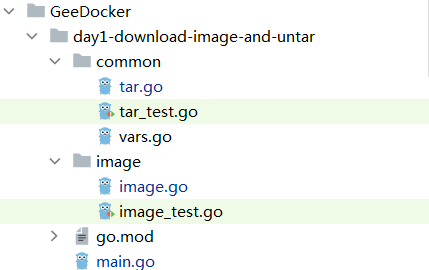

**本文是7天从零实现docker的第一篇 镜像下载和解压**

- 介绍如何用go-containerregistry三方库进行镜像下载，代码量约60行
- 了解镜像tar包内容及格式
- 解压镜像tar包的代码


**镜像操作的流程图如下：**

```json
                           是
镜像 下载 --> 检查是否已缓存 -----> 返回镜像哈希值 ⑴
                |  否             ok           
                |--> 拉取镜像到本地 --> 解压tar格式镜像 --> 处理镜像多层数据 --> 镜像元数据持久化  ⑵
```

本篇文章实现的是流程（2）中的“拉取镜像到本地”和“解压tar格式镜像”这两个步骤。

# 一、镜像下载

GeeDocker采用的镜像交互第三方库是go-containerregistry，项目地址：https://github.com/google/go-containerregistry


## 1、1 熟悉go-containerregistry中镜像拉取api函数

### 1） 从远程仓库拉取镜像

这里我最关心的是下载镜像功能，也就是go-containerregistry库中crane pull命令以及其对应的api。

```text
func Pull(src string, opt ...Option) (v1.Image, error)
```

Pull 函数功能：返回 src 标识的远程镜像的 v1.Image。

**参数src**：待拉取的镜像全称，镜像全称 = 镜像名 + tag名称 ，如alpine:latest，alpine是镜像名，latest是tag标签

**参数opt**：拉取操作的可选项，主要有WithTransport和Insecure两种

```go
func WithTransport(t http.RoundTripper) Option
```

WithTransport 是一个可选项，用于覆盖远程操作的默认传输。

```
func Insecure(o *Options)
```

Insecure 是一个可选项，它允许在没有 TLS 的情况下获取镜像引用。

### 2） 计算镜像哈希值

```
// Image 定义了与v1版本的OCI镜像交互的接口。
//go:generate counterfeiter -o fake/image.go . Image
type Image interface {

	// Manifest returns this image's Manifest object.
	Manifest() (*Manifest, error)
}
```

Image接口的Manifest()返回Manifest类型的指针。

我们来看一下Manifest结构体：

```
// Manifest represents the OCI image manifest in a structured way.
type Manifest struct {
	SchemaVersion int64             `json:"schemaVersion,omitempty"`
	MediaType     types.MediaType   `json:"mediaType"`
	Config        Descriptor        `json:"config"`
	Layers        []Descriptor      `json:"layers"`
	Annotations   map[string]string `json:"annotations,omitempty"`
}
```

c059bfaa849c是标识镜像唯一性的hash值，是如何计算出来的呢？

image的manifest的哈希值，取前12位。

标识镜像，必然要有一个唯一的标识，所以我们这样来做。


### 3） 保存镜像到本地

保存镜像到本地的函数是SaveLegacy

```text
func SaveLegacy(img v1.Image, src, path string) error
```

**函数功能**：SaveLegacy 将 v1.Image类型的img写为 linux tar类型压缩包。

**img参数**：Pull()函数返回的v1.Image对象

**src参数**: 镜像的全路径，如alpine:latest。

**path参数**：镜像的存储路径


弄懂其实现原理后，下面我们开始写代码，这里推荐一种

## 1、2 Go语言实现

代码的目录结构如下：




 day1-download-image-and-untar 目录下新建 package `image`和image.go文件，将镜像操作相关代码放在image.go文件中。

day1-download-image-and-untar 目录下新建 package `common`，在common目录下新建tar.go和vars.go文件，tar解压缩的操作代码放在tar.go文件中，项目涉及的全局变量放在vars.go中。

[GeeDocker/day1-download-image-and-untar/image/image.go]: https://github.com/haolipeng/7_day_golang_implement_from_zero/blob/master/GeeDocker/day1-download-image-and-untar/image/image.go


祛除空格后，代码量约为50行，比较少。

编写函数DownloadImageIfNessary

```go
func DownloadImageIfNessary(imageFullName string) error {
   //TODO:判断镜像在本地是否存在，不存在则下载
   //such as "alpine:latest" parse to "alpine" and "latest"
   var (
      image v1.Image
      err   error
   )

   //0.校验参数
   if imageFullName == "" {
      return errors.New("download image error,src can't empty!")
   }

   //1.从远程仓库拉取镜像
   image, err = crane.Pull(imageFullName)
   if err != nil {
      return errors.Errorf("crane.Pull error: %s", err)
   }

    //2.获取镜像的哈希值(manifest hex值的前12位)
   m, err := image.Manifest()
   imageFullHash := m.Config.Digest.Hex
   imageHexHash := imageFullHash[:12]

   //3.下载镜像并存储到本地
   err = downloadImage(image, imageFullName, imageHexHash)
   if err != nil {
      log.Println("downloadImage error:", err)
      return err
   }
}

//downloadImage 下载镜像,src is like "alpine:latest"
func downloadImage(image v1.Image, src, imageHash string) error {
	var (
		err error
	)

	//1.构造镜像存储路径，并确保路径存在，默认存储路径为"/var/lib/gocker/tmp/{imageHash}"
	imageStorageDir := common.GockerTempPath + imageHash
	err = os.MkdirAll(imageStorageDir, 0755)
	if err != nil {
		return errors.Errorf("os.MkdirAll dir %s error", imageStorageDir)
	}
	imagePath := imageStorageDir + "/package.tar"

	//2.保存镜像到本地路径,SaveLegacy保存的镜像格式为tar
	err = crane.SaveLegacy(image, src, imagePath)
	if err != nil {
		return errors.Errorf("crane.SaveLegacy error: %s", err)
	}

	return err
}
```

流程可分为四步

**第一步**：从远程仓库拉取镜像，将镜像全名(imageFullName)作为函数参数调用crane.Pull()函数

**第二步**：取镜像的manifest值中Hex值的前12位，作为哈希值。

**第三步**：镜像存储路径的创建

1、在day1-download-image-and-untar 目录下新建package `common`，在common包添加GockerTempPath变量，其值为/var/lib/gocker/tmp/）

```go
package common

//vars for linux only, not support windows and mac
const (
	GockerTempPath      = "/var/lib/gocker/tmp/"        //下载镜像临时存储目录
)
```

imagePath镜像临时存储路径为"/var/lib/gocker/tmp/{imageHash}/packaget.tar"，其中imageHash是镜像的哈希值（之前计算过），标识这是某个镜像的数据。

比如哈希值为c059bfaa849c的image 镜像，其临时存储路径是/var/lib/gocker/tmp/c059bfaa849c/package.tar


第四步：调用SaveLegacy()函数保存镜像数据到本地，函数成功则能在镜像存储路径上找到package.tar包。


# 二、解压tar格式镜像

经过第一步后，哈希值为c059bfaa849c的 镜像包package.tar已下载到/var/lib/gocker/tmp/c059bfaa849c/package.tar

下一步，将/var/lib/gocker/tmp/c059bfaa849c/package.tar包解压到当前路径下。

下面开始编写tar解压函数，在package `common`的tar.go中编写如下代码：

```go
//Untar 将tar格式的镜像压缩包，解压到指定的目录下
func Untar(tarball string, dstPath string) error {
	hardLinks := make(map[string]string)

	//1.打开文件
	file, err := os.Open(tarball)
	if err != nil {
		return errors.New("os.Open failed")
	}

	defer func(file *os.File) {
		err := file.Close()
		if err != nil {
			log.Println(err)
		}
	}(file)

	//bufio.NewReader 可提升性能
	bufReader := bufio.NewReader(file)

	//2.读取文件中的每一行内容
	reader := tar.NewReader(bufReader)
	for {
		header, err := reader.Next()
		if err == io.EOF {
			log.Println("tar file reach end of file EOF!")
			break
		} else if err != nil {
			return err
		}

		fileInfo := header.FileInfo()
		//dstFilePath 可能是文件的路径或文件夹的路径
		dstFilePath := filepath.Join(dstPath, header.Name)

		//判断镜像tar包中内容类型，文件和文件夹
		switch header.Typeflag {
		case tar.TypeDir: //目录
			//以什么权限来创建目录
			err = os.MkdirAll(dstFilePath, fileInfo.Mode())
			if err != nil {
				log.Println("os.MkdirAll error", err)
			}

			//log.Println("tar.TypeDir")
		case tar.TypeReg: //常规文件
			//拷贝普通文件到目的地址
			CopyRegFile(reader, header, dstFilePath)

			//log.Println("tar.TypeReg")
		case tar.TypeLink: //hard link
			//store details of hard links,process it finally
			linkPath := filepath.Join(dstPath, header.Linkname)
			linkPath2 := filepath.Join(dstPath, header.Name)
			hardLinks[linkPath2] = linkPath

			log.Println("tar.TypeLink")
		case tar.TypeSymlink: //Symbolic link
			err = os.Symlink(header.Linkname, dstFilePath)
			if os.IsExist(err) {
				continue
			}
			log.Println("tar.TypeSymlink")
		}
		//output header.Name
		log.Printf("name:%s\n", header.Name)
	}

	//4.要创建硬链接，目标必须存在，所以最后处理
	for k, v := range hardLinks {
		if err = os.Link(v, k); err != nil {
			return err
		}
	}

	//5.关闭打开的文件
	return nil
}
func CopyRegFile(reader io.Reader, hdr *tar.Header, dstFilePath string) {
	var (
		err  error
		file *os.File
	)

	//1.创建文件的父目录
	dstPath := filepath.Dir(dstFilePath)
	if _, err = os.Stat(dstPath); os.IsNotExist(err) {
		//父目录不存在，则创建目录
		err = os.MkdirAll(dstPath, os.FileMode(hdr.Mode))
		if err != nil {
			log.Println("os.MkdirAll failed", err)
			return
		}
	}

	//2.创建目标文件
	file, err = os.Create(dstFilePath)
	if err != nil {
		log.Println("os.Create failed", err)
		return
	}

	//3.拷贝源文件内容到目标文件
	_, err = io.Copy(file, reader)
	if err != nil {
		log.Println("io.Copy failed", err)
		return
	}
}
```

主要是func Untar(tarball string, dstPath string)函数的编写，

tarball参数：tar源文件路径

dstPath参数：文件解压路径

**其逻辑思路如下：**

**第一步**：os.Open打开tar压缩包文件，并使用bufio来提升读写性能

**第二步**：读取文件中的每一行内容，并根据header.Typeflag对内容类型进行判断，分常见文件、文件夹、符号链接、硬链接四种情况来处理：

文件：拷贝文件到目的目录

文件夹：在目的目录的基础上，创建新目录

符号链接：使用os.Symlink创建软链接

硬链接：搜集硬链接信息到map映射表中，后续统一处理。


**第三步**：代码收尾处，统一处理硬链接


# 三、测试

在package image下创建image_test.go文件

https://github.com/haolipeng/7_day_golang_implement_from_zero/blob/master/GeeDocker/day1-download-image-and-untar/image/image_test.go

```
package image

import (
   "log"
   "strings"
   "testing"
)

func TestDownloadImageIfNessary(t *testing.T) {
   err := DownloadImageIfNessary(strings.Join([]string{"alpine", "latest"}, ":"))
   if err != nil {
      log.Println("DownloadImageIfNessary error")
   }
}
```

单步调试下，看下镜像文件是否下载成功。


