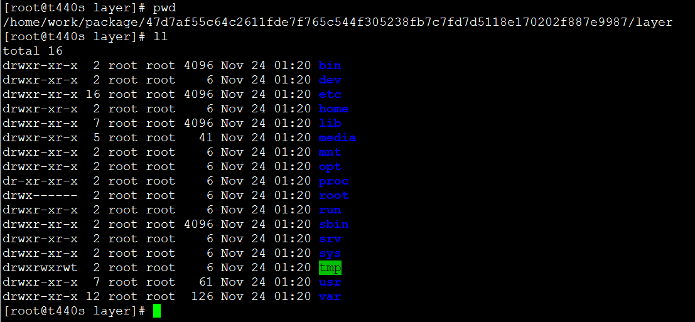
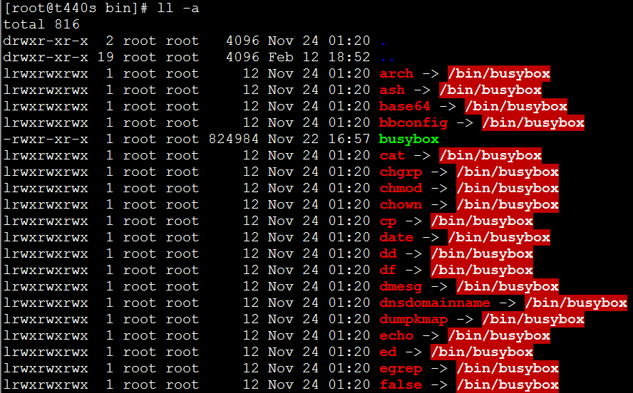

**本文是7天从零实现docker的第二篇 处理镜像分层数据**

- 了解go-containerregistry的tarball镜像格式
- 处理镜像多层Layer数据，**代码约60行**
- 文件内容拷贝函数封装，**代码约30行**


# 一、go-containerregistry的tarball镜像格式

说明下：go-containerregistry的tarball格式是有别于OCI规范的，如果大家感兴趣的话，我可以把OCI格式的规范来一篇技术博客单独讲一下。


《从实现docker的第一篇 镜像下载和解压》中镜像下载成功，我下载的是alpine:latest镜像，并进行了解压。

将下载的镜像包解压到package目录下，如下图所示：

[root@t440s package]# tree
.
├── 47d7af55c64c2611fde7f765c544f305238fb7c7fd7d5118e170202f887e9987
│   ├── json
│   ├── layer.tar
│   └── VERSION
├── c059bfaa849c4d8e4aecaeb3a10c2d9b3d85f5165c66ad3a4d937758128c4d18.json
├── manifest.json
└── repositories

1 directory, 6 files


**读者可能感兴趣packaget.tar镜像文件中，其内容的组织形式为什么是这样？**

go-containerregistry库写入的tar格式镜像包的格式如下：
manifest.json文件：在最顶层，有一个manifest.json文件包含多个镜像的信息
repositories 文件：存储
对于每个层(layer)，都会以Layer ID为名称创建目录，目录中包含以下内容：
		layer.tar - 未压缩的层 tar包
		<layer id>.json- 以Layer ID命名的json文件，包含Layer层的元数据，上述layer id为以47d7af55c开头的
		VERSION- 版本字符串，始终设置为1.0


对于从零实现docker项目来说，我们最关心的是manifest.json和layer.tar这两个文件。

## 1） manifest.json文件

manifest.json 文件中内容如下所示：

```json
[{
	"Config": "c059bfaa849c4d8e4aecaeb3a10c2d9b3d85f5165c66ad3a4d937758128c4d18.json",
	"RepoTags": ["alpine:latest"],
	"Layers": ["47d7af55c64c2611fde7f765c544f305238fb7c7fd7d5118e170202f887e9987/layer.tar"]
}]
```

其字段解释如下：

Config：配置文件路径

Layers：指明了Layer层文件的存储路径

RepoTags：镜像的名称，带有标签

其所有路径都是相当于manifest.json文件路径的相对路径。


## 2） 配置文件（了解即可）

```json
{
	"architecture": "amd64",
	"config": {
		"Hostname": "",
		"Domainname": "",
		"User": "",
		"AttachStdin": false,
		"AttachStdout": false,
		"AttachStderr": false,
		"Tty": false,
		"OpenStdin": false,
		"StdinOnce": false,
		"Env": ["PATH=/usr/local/sbin:/usr/local/bin:/usr/sbin:/usr/bin:/sbin:/bin"],
		"Cmd": ["/bin/sh"],
		"Image": "sha256:b747534ae29d08c0c84cc4326caf04e873c6d02bb67cd9c7644be2b4fa8d2f31",
		"Volumes": null,
		"WorkingDir": "",
		"Entrypoint": null,
		"OnBuild": null,
		"Labels": null
	},
	"container": "4292e8ed2ef2b6dc4bbaf8e1cda0cb5f95b96adc4aa2da3d15181b54d07a0b34",
	"container_config": {
		"Hostname": "4292e8ed2ef2",
		"Domainname": "",
		"User": "",
		"AttachStdin": false,
		"AttachStdout": false,
		"AttachStderr": false,
		"Tty": false,
		"OpenStdin": false,
		"StdinOnce": false,
		"Env": ["PATH=/usr/local/sbin:/usr/local/bin:/usr/sbin:/usr/bin:/sbin:/bin"],
		"Cmd": ["/bin/sh", "-c", "#(nop) ", "CMD [\"/bin/sh\"]"],
		"Image": "sha256:b747534ae29d08c0c84cc4326caf04e873c6d02bb67cd9c7644be2b4fa8d2f31",
		"Volumes": null,
		"WorkingDir": "",
		"Entrypoint": null,
		"OnBuild": null,
		"Labels": {}
	},
	"created": "2021-11-24T20:19:40.483367546Z",
	"docker_version": "20.10.7",
	"history": [{
		"created": "2021-11-24T20:19:40.199700946Z",
		"created_by": "/bin/sh -c #(nop) ADD file:9233f6f2237d79659a9521f7e390df217cec49f1a8aa3a12147bbca1956acdb9 in / "
	}, {
		"created": "2021-11-24T20:19:40.483367546Z",
		"created_by": "/bin/sh -c #(nop)  CMD [\"/bin/sh\"]",
		"empty_layer": true
	}],
	"os": "linux",
	"rootfs": {
		"type": "layers",
		"diff_ids": ["sha256:8d3ac3489996423f53d6087c81180006263b79f206d3fdec9e66f0e27ceb8759"]
	}
}
```

包含操作系统、容器配置、rootfs、创建时间、系统架构等信息。


## 3） Layer镜像层数据

由manifest.json文件的Layers字段可知，镜像层数据的存储路径为47d7af55c64c2611fde7f765c544f305238fb7c7fd7d5118e170202f887e9987/layer.tar


将layer.tar包创建文件夹layer并进行解压：

```bash
mkdir layer
tar xvf layer.tar -C layer
```




进入到bin目录使用ll -a命令进行查看。



bin目录中的很多命令都指向busybox。

## 4） repositories文件

```json
{
	"alpine": {
		"latest": "47d7af55c64c2611fde7f765c544f305238fb7c7fd7d5118e170202f887e9987"
	}
}
```

描述镜像的名称和tag以及sha值。

# 二、处理镜像多层Layer数据

处理镜像多层Layer数据，可大致拆解为以下逻辑：

- 从manifest.json文件中解析出镜像的layer分层信息

- 遍历每一层layer的数据，并解压layer层数据到指定目录

  由于一个镜像可能存在多个layer文件，所以存储目录路径不仅要有镜像的hash值，也要有layer的hash值，解压路径定为：/var/lib/gocker/images/{image-hash}/{layer-hash}/fs，其中{image-hash}是镜像哈希值，{layer-hash}是镜像layer层的哈希值

- 将manifest.json和{fullImageHex}.json都拷贝到/var/lib/gocker/images/{image-hash}/下面，供以后使用，{fullImageHex}是镜像的完整hex值。

在package `common`包的

在package `image`包的image.go文件中添加如下代码：

```go
type ManiFest struct {
	Config   string   `json:"config"`
	RepoTags []string `json:"RepoTags"`
	Layers   []string `json:"Layers"`
}

func ProcessLayers(imageHexHash, imageFullHash string) error {
   var (
      err          error
      content         []byte
      manifestSrcPath string
      mf              []ManiFest
   )

   //1.读取manifest.json文件
   manifestSrcPath = filepath.Join(common.GetGockerTempPath(), imageHexHash, "manifest.json")
   content, err = ioutil.ReadFile(manifestSrcPath)
   if err != nil || len(content) == 0 {
      log.Println("ioutil.ReadFile error or file content is empty!")
      return err
   }

   //2.解析 manifest.json 内容的各个字段
   err = json.Unmarshal(content, &mf)
   if err != nil {
      return err
   }

   //3.解析内容为空
   if len(mf) == 0 {
      return errors.New("can't handle empty manifest!")
   }

   //4.遍历解析到的layer层，将每层layer数据解压到指定目录
   for i, layer := range mf[0].Layers {
      fmt.Printf("Layer %d:%s\n", i, layer)

      layerTarballPath := filepath.Join(common.GetGockerTempPath(), imageHexHash, layer)
      layerHash := layer[:12]
      dstPath := filepath.Join(common.GetGockerImagePath(), imageHexHash, layerHash, "fs")
      err = os.MkdirAll(dstPath, 0644)
      if err != nil {
         fmt.Printf("os.MkdirAll %s failed!", dstPath)
      }

      //将layer.tar包解压到指定目录中
      err = common.Untar(layerTarballPath, dstPath)
      if err != nil {
         break
      }
   }

   //5.将 manifest.json文件和{fullImageHex}.json文件拷贝到/var/lib/gocker/images/{image-hash}/ 目录
   manifestDstPath := filepath.Join(common.GetGockerImagePath(), imageHexHash, "manifest.json")
   err = common.CopyFile(manifestSrcPath, manifestDstPath)
   if err != nil {
      fmt.Printf("copy manifest.json file to %s failed!\n", manifestDstPath)
      return err
   }


   //6.将 {fullImageHex}.json文件拷贝到/var/lib/gocker/images/{image-hash}/ 目录
   configFileName := fmt.Sprintf("%s.json", imageFullHash)
   configSrcPath := filepath.Join(common.GetGockerTempPath(), imageHexHash, configFileName)
   configDstPath := filepath.Join(common.GetGockerImagePath(), imageHexHash, configFileName)

   err = common.CopyFile(configSrcPath, configDstPath)
   if err != nil {
      fmt.Printf("copy %s file to %s failed!\n", configFileName, configDstPath)
      return err
   }
   return err
}
```

可分为以下步骤来详解：

## 2、1 读取manifest.json内容，并反序列化成对象

manifest.json

```json
[{
	"Config": "c059bfaa849c4d8e4aecaeb3a10c2d9b3d85f5165c66ad3a4d937758128c4d18.json",
	"RepoTags": ["alpine:latest"],
	"Layers": ["47d7af55c64c2611fde7f765c544f305238fb7c7fd7d5118e170202f887e9987/layer.tar"]
}]
```

想进行json内容的反序列化，就需要定义golang结构体

```go
type ManiFest struct {
	Config   string   `json:"config"`
	RepoTags []string `json:"RepoTags"`
	Layers   []string `json:"Layers"`
}
```

仔细看manifest.json文件，外面是中括号，说明其是个数组，所以json内容反序列化时需要采用 []ManiFest（[]是重点）

反序列化成功后，需判断下是否解析出内容（即mf切片是否为空），否则后面的代码会报错。


## 2、2 遍历每一层layer的数据，并解压layer层数据到指定目录

```
//4.遍历解析到的layer层，将每层layer数据解压到指定目录
for i, layer := range mf[0].Layers {
    fmt.Printf("Layer %d:%s\n", i, layer)

    layerTarballPath := filepath.Join(common.GetGockerTempPath(), imageHexHash, layer)
    layerHash := layer[:12]
    dstPath := filepath.Join(common.GetGockerImagePath(), imageHexHash, layerHash, "fs")
    err = os.MkdirAll(dstPath, 0644)
    if err != nil {
    	fmt.Printf("os.MkdirAll %s failed!", dstPath)
    	break
    }

    //将layer.tar包解压到指定目录中
    err = common.Untar(layerTarballPath, dstPath)
    if err != nil {
    	break
    }
}
```

layer.tar文件所在的路径为/var/lib/gocker/tmp/{imageHash}/47d7af55c64c2611fde7f765c544f305238fb7c7fd7d5118e170202f887e9987/layer.tar

其目的目录为：

/var/lib/gocker/images/{image-hash}/{layer-hash}/fs，其中{image-hash}是镜像哈希值，{layer-hash}是镜像layer层的哈希值

调用os.MkdirAll确保目的目录是存在的。

最后调用common包的Untar函数，将layer.tar中的数据解压到上述目的目录中。


## 2、3 将manifest.json和{fullImageHex}.json拷贝到镜像真正的存储路径

封装了CopyFile函数

在packege `common`包下新建copyFile.go文件，并添加如下代码

```
package common

import (
	"io"
	"log"
	"os"
)

func CopyFile(src, dst string) error {
	//1.open src file
	in, err := os.Open(src)
	if err != nil {
		return err
	}
	defer func(in *os.File) {
		err := in.Close()
		if err != nil {
			log.Println("in file close error")
		}
	}(in)

	//2.create dst file
	out, err := os.Create(dst)
	if err != nil {
		return err
	}
	defer func(out *os.File) {
		err := out.Close()
		if err != nil {
			log.Println("out file close error")
		}
	}(out)

	//3.copy file content
	_, err = io.Copy(out, in)
	if err != nil {
		return err
	}

	return nil
}
```

函数接收两个参数

src：源文件的路径

dst：目的文件的路径


# 三、测试

每次写测试用例时，都多少有点纠结，说下我测试ProcessLayers函数的做法，抛砖引玉，小伙伴们如果有更好的做法，欢迎在评论区留言。

我的做法：

1、下载镜像包并保存成package.tar文件

2、解压后得到layer.tar存储路径

3、构造参数，调用ProcessLayers函数，继而单步调试来验证每一个步骤的代码是否运行正常。


